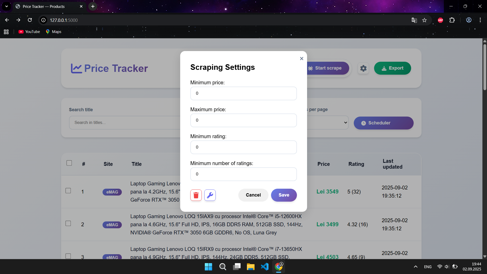

# Price Tracker

Price Tracker is a full-featured web application for monitoring product prices from multiple e-commerce sites, with price history, notifications, automatic scraping scheduling, and a modern interface.

## Contents

- [Main Features](#✨-main-features)
- [Screenshots](#📸-screenshots)
- [Technologies Used](#🛠️-technologies-used)
- [Project Structure](#📁-project-structure)
- [Installation and Running Instructions](#⚙️-installation-and-running-instructions)
- [API](#🔌-api)
- [License](#📝-license)

## ✨ Main Features

### 1. Scraping and Product Management
- **Automatic and manual scraping**: extracts data (title, price, rating, link, currency, image) from multiple sites defined in `config.json`.
- **Scraping settings**: set minimum/maximum price, minimum rating, and minimum number of ratings for products you want to save.
- **Advanced filtering**: by title, site, price range, rating, number of reviews, etc.
- **Sorting and pagination**: sort by any column, fast pagination.
- **Bulk actions**: delete or track multiple selected products.
- **Add/remove sites**: interface for quickly configuring scraping sources.

### 2. Price History and Visualization
- **Complete history**: every price change is saved and can be viewed as a table or chart.
- **Data export**: quickly export products and history to CSV, PDF, or XLSX.
- **Detailed product view**: dedicated page with all details and price history.

### 3. Notifications and Automations
- **Discord notification**: receive a DM when a tracked product drops below a certain price.
- **Set notification threshold**: you can set the price at which to be notified for each product.
- **Integrated scheduler**: automatic daily scraping scheduling, using Windows Task Scheduler.
- **Visual notification in UI**: success/error alerts for all important actions.

## 📸 Screenshots
<table>
  <tr>
    <td align="center">
      <b>Main Window</b><br>
      
    </td>
    <td align="center">
      <b>Scraping Settings</b><br>
      
    </td>
  </tr>
  <tr>
    <td align="center">
    <br>
      
    </td>
    <td align="center">
      <b>Scraping Scheduler</b><br>
      
    </td>
  </tr>
  <tr>
    <td align="center">
      <b>Site Configuration Settings</b><br>
      
    </td>
    <td align="center">
      <b>Bulk Actions</b><br>
      
    </td>
  </tr>
  <tr>
    <td align="center">
      <b>Product Page</b><br>
      
    </td>
    <td align="center">
      <b>Price Notification Settings</b><br>
      
    </td>
  </tr>
  <tr>
    <td align="center">
      <b>Price History Table</b><br>
      
    </td>
    <td align="center">
      <b>Price History Chart</b><br>
      
    </td>
  </tr>
</table>

## 🛠️ Technologies Used

- **Backend API:** FastAPI (Python, async)
- **Frontend Server:** Flask (Python, serves HTML/JS/CSS)
- **Scraping:** Playwright (async, headless Chromium)
- **Database:** SQLite
- **Frontend:** HTML, CSS, JavaScript (no framework, custom code)
- **Task Scheduling:** Windows Task Scheduler (via Python script)
- **Notifications:** Discord Bot (via DM)

## 📁 Project Structure

```
Backend/
  API.py              # FastAPI backend (REST API)
  app.py              # Flask server (serves frontend)
  Database.py         # SQLite logic
  Matcher.py          # Matching algorithm for scraping result filtering
  Scheduler.py        # Integration with Windows Task Scheduler
  SchedulerStarter.py # Script for scheduled scraping and Discord notifications
  Scrape_worker.py    # Worker for scraping jobs
  Scraper.py          # Main scraping logic
Data/
  config.json         # Site, filter, Discord, scheduling configuration
  tracker.db          # SQLite database
Frontend/
  HTML/               # HTML templates
  CSS/                # Modern styles
  JS/                 # Frontend logic (AJAX, UI, charts)
```

## ⚙️ Installation and Running Instructions

1. **Requirements:**
   - Python 3.10+
   - Node.js (for Playwright)
   - Windows (for automatic scheduling)

2. **Install Python packages:**
   ```sh
   pip install -r requirements.txt
   ```

3. **Install Playwright and browsers:**
   ```sh
   playwright install
   ```

4. **Start backend API:**
   ```sh
   cd Backend
   uvicorn API:APP --reload --host 0.0.0.0 --port 8000
   ```

5. **Start frontend server:**
   ```sh
   cd Backend
   python app.py
   ```
   - Access the app at [http://127.0.0.1:5000](http://127.0.0.1:5000)

6. **Discord configuration (optional):**
   - Create a Discord bot, add the token in `.env` and the user_id using the interface to receive DMs for tracked products.

7. **Scheduling configuration (optional):**
   - Use the interface to set the time and query for automatic scraping.

## 🔌 API

Endpoint examples (`Backend/API.py`):

- `GET /products` — List products (filter, sort, paginate)
- `GET /products/{id}` — Product details
- `GET /products/{id}/history` — Price history
- `POST /scrape/trigger` — Start manual scraping
- `GET /scrape/status` — Scraping status
- `POST /products/bulk_delete` — Bulk delete
- `POST /delete_db` — Delete database
- `POST /change_config` — Change config
- `GET /get_site_settings` — Get site settings
- `POST /set_site_settings` — Change site settings
- `GET /product_image` — Return product image
- `GET /export_csv|pdf|xlsx` — Export data
- `POST /add_schedule|delete_schedule` — Add/delete scraping schedule
- `POST /add_watch_products|delete_watch_products` — Add/delete tracked products
- `GET /is_product_tracked` — Check if a product is tracked
- `POST /set_notify_price` — Set notification threshold
- `GET /total_products` — Total number of products

## 📝 License

MIT License. See the `LICENSE` file for details.
